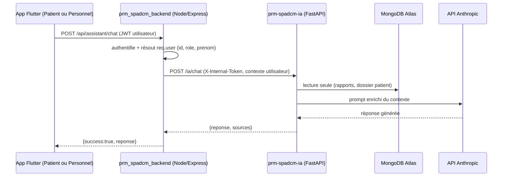

# prm-spadcm-ia — Service Intelligence Artificielle du PRM SPAD Cameroun

Service **Python/FastAPI**, séparé du backend Node (`prm_spadcm_backend`), qui porte toute la partie IA du projet :

- **Chatbot conversationnel augmenté** (`/ia/chat`) — répond en utilisant les vraies données du patient concerné (mini-RAG), pas seulement un LLM générique.
- **Résumé automatique des rapports journaliers** (`/ia/resume-rapports`).
- **Analyse de l'évolution de l'état de santé** (`/ia/evolution-sante`) — statistique, sans dépendance à un LLM externe.
- **Suivi/scoring de la performance des AVS** (`/ia/performance-avs`) — ponctualité rapports + présence + appréciations familles.
- **Recherche sémantique** (`/ia/recherche-semantique`) — TF-IDF pour l'instant, conçu pour évoluer vers de vrais embeddings.
- **Détection d'anomalies / alertes intelligentes** (`/ia/alertes-intelligentes`) — règles de seuils sur les constantes vitales.

Ce service est **utile à tous les rôles** (patient/famille, AVS, coordonnateur, administrateur, médecin) : c'est le backend Node qui l'appelle, après avoir authentifié l'utilisateur et déterminé son rôle — les apps Flutter ne parlent jamais directement à ce service.

> Contexte : voir le README.md du dépôt principal (`prm_spadcm_backend` / `prm_spadcm_patient` / `prm_spadcm_personnel`), section 8 et 11, pour la feuille de route complète. Ce dépôt correspond à la Phase 5 de cette feuille de route.

---

## Table des matières

1. [Prérequis](#1-prérequis)
2. [Structure du projet (création)](#2-structure-du-projet-création)
3. [Installation](#3-installation)
4. [Configuration (.env)](#4-configuration-env)
4bis. [Changer de fournisseur LLM (Gemini / Groq / Ollama / Anthropic)](#4bis-changer-de-fournisseur-llm-gemini--groq--ollama--anthropic)
5. [Lancer le service en local](#5-lancer-le-service-en-local)
6. [Endpoints disponibles](#6-endpoints-disponibles)
7. [Communication avec l'application (backend Node)](#7-communication-avec-lapplication-backend-node)
8. [Déploiement sur Vercel](#8-déploiement-sur-vercel)
9. [Sécurité](#9-sécurité)
10. [Limites actuelles & pistes d'évolution](#10-limites-actuelles--pistes-dévolution)
11. [Dépannage](#11-dépannage)

---

## 1. Prérequis

- **Python 3.11** (validé avec ta version — `python --version` → `Python 3.11.0`). Le code utilise la syntaxe `str | None` (union types), disponible à partir de Python 3.10, donc 3.11 convient parfaitement.
- Accès à la **même base MongoDB Atlas** que `prm_spadcm_backend` (voir section 4 pour créer un utilisateur en lecture seule).
- Une **clé API Anthropic** (`https://console.anthropic.com`) — optionnelle au démarrage, mais nécessaire pour `/ia/chat` et `/ia/resume-rapports`.
- `pip` à jour (`python -m pip install --upgrade pip`).

---

## 2. Structure du projet (création)

```
prm-spadcm-ia/
├── app/
│   ├── main.py                      # point d'entrée FastAPI (routes, CORS, gestion d'erreurs)
│   ├── core/
│   │   ├── config.py                 # variables d'environnement typées (pydantic-settings)
│   │   └── security.py               # vérification du token de service (X-Internal-Token)
│   ├── db/
│   │   └── mongo.py                  # connexion MongoDB (motor), LECTURE SEULE
│   ├── schemas/                      # modèles Pydantic des requêtes/réponses
│   │   ├── common.py
│   │   ├── chat.py
│   │   ├── rapports.py
│   │   └── performance.py
│   ├── services/                     # toute la logique métier IA (indépendante de FastAPI)
│   │   ├── llm.py                    # client Anthropic (même convention que le backend Node)
│   │   ├── callback_backend.py       # callback HTTP vers Node pour écrire un résultat
│   │   ├── donnees.py                # accès Mongo en lecture seule (rapports, patients, AVS...)
│   │   ├── chat.py                   # RAG léger pour le chatbot
│   │   ├── resume.py                 # résumé de rapports (LLM)
│   │   ├── evolution.py              # évolution santé (statistique, sans LLM)
│   │   ├── performance_avs.py        # scoring AVS (sans LLM)
│   │   ├── recherche_semantique.py   # TF-IDF (sans LLM)
│   │   └── alertes.py                # détection d'anomalies (règles, sans LLM)
│   └── api/routes/                   # un routeur FastAPI par domaine, tous protégés par le token de service
│       ├── health.py                 # GET /health (pas de token requis, pour le monitoring)
│       ├── chat.py
│       ├── resume.py
│       ├── evolution.py
│       ├── performance.py
│       ├── recherche.py
│       └── alertes.py
├── requirements.txt
├── .env.example
├── vercel.json                       # déploiement en fonctions serverless Python
└── .gitignore
```

**Pourquoi cette organisation ?** `services/` ne dépend jamais de FastAPI : c'est là que vit la logique IA "pure" (calculs, appels Mongo, appels LLM). `api/routes/` ne fait que brancher un endpoint HTTP sur une fonction de `services/`. Ça permet de tester/faire évoluer chaque brique IA indépendamment du framework web, et de réutiliser une fonction de service dans plusieurs endpoints (ex. `texte_rapport()` utilisée à la fois par le résumé et la recherche sémantique).

---

## 3. Installation

```bash
# 1. Se placer dans le dossier du service
cd prm-spadcm-ia

# 2. Créer un environnement virtuel dédié (recommandé, évite les conflits
#    avec d'autres projets Python sur ta machine)
python -m venv .venv

# 3. L'activer
# Windows (PowerShell) :
.venv\Scripts\Activate.ps1
# Windows (cmd.exe) :
.venv\Scripts\activate.bat
# macOS / Linux :
source .venv/bin/activate

# 4. Installer les dépendances
pip install -r requirements.txt
```

Dépendances principales (voir `requirements.txt`) : `fastapi`, `uvicorn`, `motor`/`pymongo` (MongoDB asynchrone), `pydantic`/`pydantic-settings`, `httpx` (appels HTTP vers Anthropic et vers le backend Node), `scikit-learn`/`numpy` (TF-IDF et calculs statistiques — aucune dépendance lourde type `torch`, volontairement, pour rester compatible avec un déploiement serverless Vercel).

---

## 4. Configuration (.env)

```bash
cp .env.example .env
```

Puis remplir `.env` :

| Variable | Description |
|---|---|
| `PORT` | Port d'écoute en local (défaut `8010`). |
| `ENV` | `development` ou `production`. |
| `MONGO_URI` | **Même cluster Atlas** que `prm_spadcm_backend`, mais avec un **utilisateur dédié en lecture seule** (voir ci-dessous). |
| `MONGO_DB_NAME` | Nom de la base (ex. `prm_spad_test` en dev, ou le nom de la base de production). |
| `IA_SERVICE_TOKEN` | Secret partagé avec le backend Node — protège toutes les routes `/ia/*`. **Doit être une valeur longue et aléatoire**, identique des deux côtés. |
| `IA_SERVICE_URL` | Informatif : URL publique de ce service, pour se souvenir de ce qu'il faut mettre côté Node. |
| `ANTHROPIC_API_KEY` / `ANTHROPIC_MODEL` | Optionnel — utilisé seulement si `LLM_PROVIDER=anthropic`. Payant. |
| `LLM_PROVIDER` | **`gemini`** (défaut, gratuit sans CB), `groq` (gratuit, rapide), `ollama` (local, gratuit), ou `anthropic` (payant). Voir section 4bis. |
| `GEMINI_API_KEY` / `GEMINI_MODEL` | Clé gratuite sur [Google AI Studio](https://aistudio.google.com/apikey), aucune carte bancaire requise. |
| `GROQ_API_KEY` / `GROQ_MODEL` | Clé gratuite sur [console.groq.com](https://console.groq.com/keys). |
| `OLLAMA_BASE_URL` / `OLLAMA_MODEL` | Pas de clé : juste l'URL du serveur Ollama local (`http://localhost:11434` par défaut). |
| `BACKEND_URL` | URL du backend Node, pour les callbacks d'écriture (ex. `http://localhost:4000` en dev). |
| `BACKEND_CALLBACK_TOKEN` | Second secret, distinct de `IA_SERVICE_TOKEN`, pour le sens **IA → Node** (voir section 7). |
| `RAG_TOP_K` | Nombre de rapports réinjectés dans le contexte du chatbot (défaut `6`). |

### 4bis. Changer de fournisseur LLM (Gemini / Groq / Ollama / Anthropic)

Tout l'appel LLM est isolé dans **un seul fichier** : `app/services/llm.py`. La fonction `generer_texte(system_prompt, messages, max_tokens)` a la **même signature** quel que soit le fournisseur — c'est la seule fonction que le reste du service (`chat.py`, `resume.py`) appelle. Changer de fournisseur ne demande donc **aucune modification de code**, juste `.env` :

```bash
# Pour utiliser Gemini (gratuit, recommandé pour démarrer) :
LLM_PROVIDER=gemini
GEMINI_API_KEY=xxxxx        # obtenue sur https://aistudio.google.com/apikey
GEMINI_MODEL=gemini-3.6-flash

# Pour utiliser Groq à la place (gratuit, très rapide) :
LLM_PROVIDER=groq
GROQ_API_KEY=xxxxx          # obtenue sur https://console.groq.com/keys
GROQ_MODEL=llama-3.3-70b-versatile

# Pour utiliser Ollama en local (100% gratuit, données qui ne sortent
# jamais de la machine — pratique en développement) :
LLM_PROVIDER=ollama
OLLAMA_BASE_URL=http://localhost:11434
OLLAMA_MODEL=llama3
# (après avoir installé https://ollama.com, lancé `ollama serve`
# et téléchargé le modèle : `ollama pull llama3`)
```

Redémarrer le service après modification du `.env` (`uvicorn` recharge automatiquement en mode `--reload`, sinon relancer la commande).

**Chaque fournisseur a un format de requête/réponse différent** (Gemini sépare le prompt système et utilise `role: "model"` au lieu de `"assistant"`, Groq/Ollama sont au format "façon OpenAI") : c'est justement ce que `app/services/llm.py` normalise en interne, pour que `chat.py`/`resume.py` n'aient jamais à s'en soucier.

---

### Créer l'utilisateur MongoDB Atlas en lecture seule

1. Se connecter à [MongoDB Atlas](https://cloud.mongodb.com), ouvrir le projet du cluster `prm-spadcm-database`.
2. **Database Access → Add New Database User.**
3. Méthode d'authentification : mot de passe. Nom d'utilisateur, ex. `ia-service-readonly`.
4. **Database User Privileges → Add Specific Privilege** (pas "Read and write to any database") → sélectionner le rôle **`read`** sur la base utilisée par le projet (ex. `prm_spad_test` en dev, la base de prod ensuite).
5. Générer un mot de passe fort, construire l'URI de connexion sur le même modèle que celle du backend Node (voir `.env.example` du backend), en remplaçant utilisateur/mot de passe.
6. Coller cette URI dans `MONGO_URI` de ce service.

> Pourquoi un utilisateur séparé plutôt que de réutiliser celui du backend Node ? Parce que celui du backend a des droits d'écriture (nécessaires pour le reste de l'API). Ce service n'a **jamais** besoin d'écrire dans MongoDB (voir section 9, Sécurité) : lui donner un compte en lecture seule est une protection supplémentaire si jamais une clé venait à fuiter.

### Générer un secret pour `IA_SERVICE_TOKEN` / `BACKEND_CALLBACK_TOKEN`

```bash
python -c "import secrets; print(secrets.token_urlsafe(48))"
```
Exécuter deux fois pour obtenir deux valeurs différentes (une pour chaque secret).

---

## 5. Lancer le service en local

```bash
uvicorn app.main:app --reload --port 8010
```

Vérifier que ça tourne :

```bash
curl http://127.0.0.1:8010/health
# {"status":"ok","env":"development","llm_configure":true,"mongo_configure":true}
```

Documentation interactive générée automatiquement par FastAPI : `http://127.0.0.1:8010/docs`.

> Si `MONGO_URI` est injoignable au démarrage, le service **démarre quand même** (log d'avertissement), mais chaque appel à un endpoint `/ia/*` qui a besoin de Mongo renverra une erreur `503` explicite tant que la base n'est pas accessible — plutôt que de bloquer tout le service.

---

## 6. Endpoints disponibles

Toutes les routes `/ia/*` exigent l'en-tête `X-Internal-Token: <IA_SERVICE_TOKEN>`. `GET /health` est public (pour le monitoring), sans donnée sensible.

| Méthode | Route | Corps (résumé) | Utilité |
|---|---|---|---|
| GET | `/health` | — | Vérifie que le service tourne, que Mongo/LLM sont configurés. |
| POST | `/ia/chat` | `message`, `historique[]`, `utilisateur{id,role,prenom}`, `patient_id?` | Chatbot augmenté par les données du patient concerné. |
| POST | `/ia/resume-rapports` | `patient_id`, `date_debut?`, `date_fin?`, `ecrire_dans_rapport_id?` | Résumé en langage naturel des rapports d'une période. |
| POST | `/ia/evolution-sante` | `patient_id`, `jours` (7–180) | Tendance (stable / amélioration / dégradation à surveiller) + points journaliers. |
| POST | `/ia/performance-avs` | `avs_id?`, `jours` (7–180) | Score 0–100 par AVS (ou classement de tous les AVS si `avs_id` absent). |
| POST | `/ia/recherche-semantique` | `requete`, `patient_id`, `top_k?` | Recherche par similarité dans les rapports d'un patient. |
| POST | `/ia/alertes-intelligentes` | `patient_id` | Anomalies détectées sur le dernier relevé + proposition d'alerte. |

Le détail exact des champs (types, contraintes) est dans `app/schemas/` et visible en direct sur `/docs`.

### Exemple — `/ia/chat`

```bash
curl -X POST http://127.0.0.1:8010/ia/chat \
  -H "Content-Type: application/json" \
  -H "X-Internal-Token: <IA_SERVICE_TOKEN>" \
  -d '{
    "message": "Comment va Maman depuis cette semaine ?",
    "historique": [],
    "utilisateur": {"id": "66f...", "role": "patient", "prenom": "Aïcha"},
    "patient_id": "66a..."
  }'
```

---

## 7. Communication avec l'application (backend Node)

> **Réponse directe à "dois-je modifier mon backend pour Gemini/Groq/Ollama ?"** Non, **si** tu adoptes l'architecture cible décrite ici : le backend Node ne parle plus jamais à un LLM lui-même, il parle uniquement à ce service (`/ia/chat`), qui gère Gemini/Groq/Ollama/Anthropic en interne (section 4bis). Le champ `ANTHROPIC_API_KEY` du `.env.example` du backend devient alors **inutile et supprimable** : la clé LLM (Gemini, dans ton cas) vit uniquement dans le `.env` de ce service IA, jamais dans le backend Node. Le seul cas où tu devrais toucher au backend pour changer de fournisseur, c'est si tu **gardes l'ancienne implémentation actuelle** de `assistantController.js` (celle qui appelle Anthropic directement, sans passer par ce service) : dans ce cas précis, il faudrait réécrire ce contrôleur pour appeler Gemini avec son propre format de requête — ce que la section 7.2 ci-dessous évite justement, en migrant vers ce service dès maintenant.


**Principe** : les apps Flutter ne parlent **jamais** directement à `prm-spadcm-ia`. Seul `prm_spadcm_backend` l'appelle, côté serveur, après avoir authentifié l'utilisateur (JWT) — exactement comme il le fait déjà pour l'API Anthropic dans `assistantController.js`.



### 7.1 Variables à ajouter côté backend Node (`.env`)

```bash
# --- Service IA (prm-spadcm-ia) ---
IA_SERVICE_URL=http://localhost:8010
IA_SERVICE_TOKEN=<la_même_valeur_que_IA_SERVICE_TOKEN_du_service_IA>
BACKEND_CALLBACK_TOKEN=<la_même_valeur_que_BACKEND_CALLBACK_TOKEN_du_service_IA>
```

> Une fois `assistantController.js` migré (section 7.2), tu peux **retirer** `ANTHROPIC_API_KEY` du `.env`/`.env.example` du backend Node : ce n'est plus lui qui appelle un LLM, c'est ce service IA (avec `GEMINI_API_KEY`, désormais gratuit — voir section 4bis).

### 7.2 Appeler ce service depuis `assistantController.js`

Remplacer (ou compléter, avec repli sur l'appel direct existant en cas d'échec) l'appel direct à Anthropic par un appel à ce service :

```javascript
// controllers/assistantController.js — nouvelle version qui délègue au service IA
const chatAssistant = catchAsync(async (req, res) => {
  const { message, historique = [] } = req.body;
  if (!message?.trim()) throw new ApiError(400, 'Le message est requis');

  const reponseIA = await fetch(`${process.env.IA_SERVICE_URL}/ia/chat`, {
    method: 'POST',
    headers: {
      'content-type': 'application/json',
      'x-internal-token': process.env.IA_SERVICE_TOKEN,
    },
    body: JSON.stringify({
      message,
      historique,
      utilisateur: {
        id: req.user._id.toString(),
        role: req.user.role,
        prenom: req.user.prenom,
        nom: req.user.nom,
      },
      // patient_id optionnel : à transmettre si l'AVS/médecin/coordonnateur
      // consulte le dossier d'un patient précis au moment de la question.
      patient_id: req.body.patientId || null,
    }),
  });

  if (!reponseIA.ok) {
    throw new ApiError(502, `Service IA momentanément indisponible (${reponseIA.status})`);
  }

  const donnees = await reponseIA.json();
  res.status(200).json({ success: true, reponse: donnees.reponse });
});
```

### 7.3 Nouvel endpoint à ajouter côté Node pour le callback IA → Node

Ce service ne peut jamais écrire dans MongoDB (lecture seule, voir section 9). Quand `/ia/resume-rapports` est appelé avec `ecrire_dans_rapport_id`, il tente un callback vers `PATCH /api/rapports/:id/resume-ia`, qui **n'existe pas encore côté Node** — à ajouter :

```javascript
// middlewares/internalTokenMiddleware.js (NOUVEAU fichier)
const ApiError = require('../utils/ApiError');

module.exports = function verifierTokenInterne(req, res, next) {
  const token = req.headers['x-internal-token'];
  if (!process.env.BACKEND_CALLBACK_TOKEN) {
    return next(new ApiError(503, 'BACKEND_CALLBACK_TOKEN non configuré côté backend'));
  }
  if (token !== process.env.BACKEND_CALLBACK_TOKEN) {
    return next(new ApiError(401, 'Token interne invalide'));
  }
  next();
};
```

```javascript
// controllers/rapportController.js (ajout)
const mettreAJourResumeIA = catchAsync(async (req, res) => {
  const { resumeIA } = req.body;
  if (!resumeIA) throw new ApiError(400, 'resumeIA est requis');

  const rapport = await RapportJournalier.findByIdAndUpdate(
    req.params.id,
    { resumeIA },
    { new: true }
  );
  if (!rapport) throw new ApiError(404, 'Rapport introuvable');

  res.status(200).json({ success: true, rapport });
});

module.exports = { /* ...exports existants... */, mettreAJourResumeIA };
```

```javascript
// routes/rapportRoutes.js — ajouter AVANT `router.use(protect)`, car cet
// appel vient du service IA (token interne), pas d'un utilisateur avec JWT
const verifierTokenInterne = require('../middlewares/internalTokenMiddleware');
const { mettreAJourResumeIA /* + exports existants */ } = require('../controllers/rapportController');

router.patch('/:id/resume-ia', verifierTokenInterne, mettreAJourResumeIA);

router.use(protect); // reste inchangé, pour toutes les routes suivantes
```

> Ces trois extraits ne sont **pas encore appliqués** au code de `prm_spadcm_backend` (ce dépôt ne contient que le service IA) : à copier dans le projet backend pour fermer la boucle. Dis-moi si tu veux que je les applique directement au zip du backend dans un prochain échange.

---

## 8. Déploiement sur Vercel

`vercel.json` est déjà fourni (fonctions Python serverless) :

```bash
npm i -g vercel   # si pas déjà installé
cd prm-spadcm-ia
vercel login
vercel            # déploiement de preview
vercel --prod     # déploiement de production
```

Configurer les variables d'environnement du projet Vercel (Dashboard → Project → Settings → Environment Variables) avec exactement les mêmes clés que `.env.example` (`MONGO_URI`, `MONGO_DB_NAME`, `IA_SERVICE_TOKEN`, `ANTHROPIC_API_KEY`, `ANTHROPIC_MODEL`, `BACKEND_URL`, `BACKEND_CALLBACK_TOKEN`, `RAG_TOP_K`).

**Points d'attention spécifiques à Vercel (serverless)** :
- **Cold start** : la première requête après une période d'inactivité peut être plus lente (import de `scikit-learn`/`numpy` + connexion Mongo). Pour un usage interne (backend → service IA), c'est un compromis acceptable au démarrage du projet.
- **Timeout** : les fonctions Vercel ont une durée d'exécution maximale (variable selon le plan). Les appels LLM (`/ia/chat`, `/ia/resume-rapports`) doivent rester sous cette limite — le `timeout=30.0` dans `app/services/llm.py` est déjà pensé pour rester large marge en-dessous.
- **Deux projets Vercel distincts** : ce service doit être déployé comme un **projet Vercel séparé** de `prm_spadcm_backend` (deux `vercel.json`, deux jeux de variables d'environnement), même s'ils peuvent être dans le même compte/organisation Vercel.
- Vercel sert bien l'**inférence** (répondre aux requêtes `/ia/*`), mais **pas l'entraînement** de futurs modèles maison (voir section 10) : ça reste un travail à faire en local ou sur un environnement à part, dont le résultat (fichiers de modèle) est ensuite chargé par ce service.

---

## 9. Sécurité

- **Ce service n'a jamais de droit d'écriture direct sur MongoDB** : l'utilisateur Atlas utilisé (`MONGO_URI`) doit être configuré en lecture seule (`read`), voir section 4. Toute écriture passe par un callback HTTP vers le backend Node, qui reste seul décisionnaire (voir `app/services/callback_backend.py` et section 7.3).
- **Jamais exposé directement aux apps Flutter** : seul le backend Node connaît `IA_SERVICE_URL`/`IA_SERVICE_TOKEN`.
- **Deux secrets distincts, pas un seul** : `IA_SERVICE_TOKEN` (Node → IA) et `BACKEND_CALLBACK_TOKEN` (IA → Node) protègent chacun un sens de communication ; une fuite de l'un ne compromet pas l'autre.
- **Aucune décision clinique automatique** : `/ia/alertes-intelligentes` ne crée jamais d'`Alerte` — il renvoie une proposition (`proposition_alerte: true/false`) que le backend Node (ou un humain côté coordonnateur) décide de transformer en alerte réelle.
- Les erreurs Mongo/inattendues sont interceptées globalement (`app/main.py`) pour ne **jamais renvoyer de stack trace** au client, seulement dans les logs serveur.
- `ANTHROPIC_API_KEY` et les secrets ne doivent jamais être commités (`.gitignore` exclut déjà `.env`).

---

## 10. Limites actuelles & pistes d'évolution

Ce service est un **point de départ fonctionnel**, pas un aboutissement — assumé comme tel :

- **Recherche sémantique** : TF-IDF recalculé à la volée par patient (`app/services/recherche_semantique.py`), pas encore de vraie base vectorielle. Piste : remplacer `TfidfVectorizer` par des embeddings de phrases (ex. modèle `sentence-transformers` multilingue léger) et indexer en continu dans **MongoDB Atlas Vector Search** (même cluster, pas de synchronisation à gérer entre deux bases) ou un vector store managé.
- **Évolution santé / alertes** : règles et seuils simples, volontairement explicables comme premier jet (`app/services/evolution.py`, `app/services/alertes.py`). Piste : une fois qu'il y a assez d'historique réel par patient, entraîner un modèle qui détecte les écarts par rapport à **l'historique propre du patient** plutôt que des seuils génériques.
- **Performance AVS** : scoring pondéré manuellement (`POIDS_*` dans `app/services/performance_avs.py`). Piste : modèle supervisé une fois qu'il existe un historique suffisant pour définir un "bon" label de performance avec l'équipe SPAD.
- **Chat/RAG** : contexte limité aux 7 derniers rapports d'**un seul** patient à la fois (`RAG_TOP_K`). Piste : étendre à un vrai RAG multi-documents (messages, appréciations, dossier complet) une fois la base vectorielle en place.
- **LLM de génération** : reste un appel à l'API Anthropic externe (`app/services/llm.py`). Piste, si la souveraineté des données de santé l'exige un jour : remplacer par un modèle open-source auto-hébergé — un seul fichier à changer, le reste du service n'en dépend pas directement.

---

## 11. Dépannage

| Symptôme | Cause probable | Solution |
|---|---|---|
| `GET /health` → `mongo_configure: false` | `MONGO_URI` vide dans `.env` | Vérifier que `.env` est bien chargé (le service doit être lancé depuis le dossier `prm-spadcm-ia`). |
| Toute route `/ia/*` → `503 IA_SERVICE_TOKEN non configuré` | `IA_SERVICE_TOKEN` vide | Renseigner `IA_SERVICE_TOKEN` dans `.env` (voir section 4). |
| Toute route `/ia/*` → `401 Token de service invalide` | En-tête `X-Internal-Token` absent ou différent de `IA_SERVICE_TOKEN` | Vérifier que le backend Node envoie bien le même secret (section 7.1). |
| `/ia/chat` ou `/ia/resume-rapports` → `503 ANTHROPIC_API_KEY non configurée` | Clé Anthropic absente | Renseigner `ANTHROPIC_API_KEY` dans `.env`. |
| N'importe quelle route Mongo → `503 Base de données indisponible` | `MONGO_URI` injoignable (mauvais utilisateur/mot de passe, IP non whitelistée sur Atlas) | Vérifier **Network Access** sur Atlas (autoriser l'IP du serveur, ou `0.0.0.0/0` en dev uniquement) et les identifiants de l'utilisateur lecture seule. |
| Démarrage lent (~5-6s) | Normal : le service tente de joindre Mongo au démarrage avec un timeout de 6s avant de continuer | Pas d'action nécessaire ; une fois Mongo joignable, le démarrage redevient quasi instantané. |
